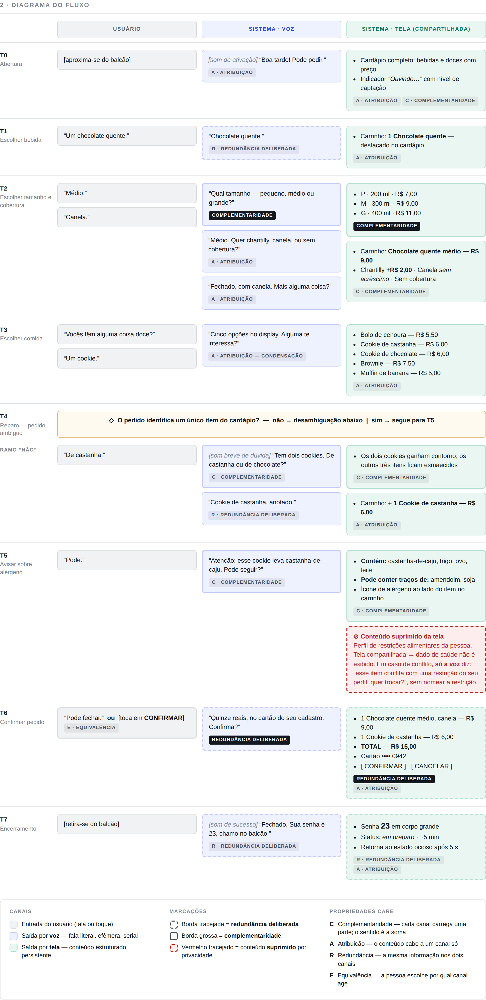

# Fluxo multimodal de atendimento — Cafeteria do campus Inteli

Projeto de um fluxo de interação **voz + tela** para atendimento de cafeteria, em que cada decisão de conteúdo é alocada a um canal e justificada pelas **propriedades CARE** e pela **regra de condensação**, focando no entendimento do raciocínio de alocação: por que este conteúdo cabe à voz, este à tela e este aos dois.

---

## 1. Agrupamento de dispositivo adotado: tela auxiliar compartilhada

A taxonomia do *Scale your design* (Google Conversation Design Guidelines) classifica o dispositivo pelo **papel da tela em relação à voz**. nesse sentido, considerei o display fixo atrás do balcão da cafeteria, visível para quem atende e para a fila, bem como a voz como canal condutor, onde só ela abre turno, pergunta e negocia reparos. Nesse contexto, a tela é apoio e **não aceita entrada**, com a única exceção dos botões *Confirmar* e *Cancelar* no fechamento do pedido. Não é possível montar um pedido apenas tocando, o que distingue este agrupamento de uma tela equivalente.

Duas consequências atravessam todo o projeto:

- a tela pode receber listas, preços e composições que não cabem serem enunciadas por voz;
- **tudo que aparece na tela é público**, o que restringe o tratamento de informação sensível no turno do alérgeno.

---

## 2. Conceitos aplicados

### Propriedades CARE

Framework de Coutaz, Nigay, Salber, Blandford, May e Young (1995) para descrever a relação entre modalidades em uma interação multimodal.

| Sigla | Propriedade | Definição operacional |
|---|---|---|
| **C** | Complementaridade | Cada canal carrega uma **parte** da informação; o sentido só existe na soma. |
| **A** | Atribuição | O conteúdo cabe a **um canal só**, sem alternativa. |
| **R** | Redundância | A **mesma** informação vai aos dois canais, deliberadamente. |
| **E** | Equivalência | Os dois canais são **intercambiáveis** para o mesmo fim, e a pessoa escolhe. |

Atribuição e Equivalência tratam de **escolha de canal**; Complementaridade e Redundância tratam de **distribuição de conteúdo**.

### Regra de condensação

O prompt falado **não reproduz** o conteúdo estruturado que está na tela. A voz enquadra e conduz; a tela carrega o detalhe. Aplicação no fluxo: diante do pedido de cardápio, o sistema diz *"cinco opções no display. Alguma te interessa?"* em vez de enumerar os cinco doces — a fala quantifica o esforço e devolve o turno.

### Redundância deliberada vs. redundância nociva

| | Critério | Exemplo no fluxo |
|---|---|---|
| **Deliberada** | O ganho justifica o custo de turno: percepção de erro, compromisso irreversível ou necessidade de persistência. | O total (R$ 15,00) é falado **e** exibido, único ponto com compromisso financeiro irreversível. |
| **Nociva** | Duplica conteúdo estruturado num canal serial e efêmero, alongando o turno sem acrescentar informação. | Ler em voz alta os cinco doces que a tela já exibe: a voz deixa de conduzir e vira leitora de tela. |

### Tela pessoal vs. tela compartilhada

O caráter da tela decide o tratamento de informação sensível. O projeto separa duas coisas frequentemente tratadas como uma só:

- **Atributo do produto** — *"este cookie contém castanha-de-caju"*. Vale para qualquer cliente e pode ocupar a tela pública.
- **Atributo da pessoa** — *"você registrou alergia a castanhas"*. É dado de saúde; numa tela que a fila enxerga, exibi-lo divulga a terceiros algo que a pessoa não escolheu divulgar.

---

## 4. Diagrama do fluxo

### Legenda do diagrama

| Marcação | Significado |
|---|---|
| Raia cinza | Entrada do usuário (fala ou toque) |
| Raia azul | Saída por **voz** — fala literal, efêmera, serial |
| Raia verde | Saída por **tela** — conteúdo estruturado, persistente |
| Borda tracejada | Redundância deliberada |
| Borda grossa | Complementaridade |
| Borda vermelha tracejada | Conteúdo suprimido por privacidade |

### Roteiro dos turnos

| Turno | Usuário | Sistema · Voz | Sistema · Tela |
|---|---|---|---|
| **T0** · Abertura | *[aproxima-se do balcão]* | *[som de ativação]* "Boa tarde! Pode pedir." | Cardápio completo com preços · indicador "Ouvindo…" |
| **T1** · Bebida | "Um chocolate quente." | "Chocolate quente." | Carrinho: **1 Chocolate quente** |
| **T2** · Tamanho e cobertura | "Médio." / "Canela." | "Qual tamanho: pequeno, médio ou grande?" · "Médio. Quer chantilly, canela, ou sem cobertura?" · "Fechado, com canela. Mais alguma coisa?" | P 200 ml R$ 7,00 · M 300 ml R$ 9,00 · G 400 ml R$ 11,00 → Carrinho R$ 9,00 · Chantilly +R$ 2,00, canela sem acréscimo |
| **T3** · Comida | "Vocês têm alguma coisa doce?" / "Um cookie." | "Cinco opções no display. Alguma te interessa?" | Bolo de cenoura R$ 5,50 · Cookie de castanha R$ 6,00 · Cookie de chocolate R$ 6,00 · Brownie R$ 7,50 · Muffin de banana R$ 5,00 |
| **T4** · Reparo (pedido ambíguo) | "De castanha." | *[som breve de dúvida]* "Tem dois cookies. De castanha ou de chocolate?" · "Cookie de castanha, anotado." | Os dois cookies ganham contorno; os outros três ficam esmaecidos → Carrinho **+ R$ 6,00** |
| **T5** · Alérgeno | "Pode." | "Atenção: esse cookie leva castanha-de-caju. Pode seguir?" | **Contém:** castanha-de-caju, trigo, ovo, leite · **Traços de:** amendoim, soja · ⊘ perfil de restrições **suprimido** |
| **T6** · Confirmação | "Pode fechar." **ou** *[toca em CONFIRMAR]* | "Quinze reais, no cartão do seu cadastro. Confirma?" | Composição item a item · **TOTAL R$ 15,00** · Cartão •••• 0942 · [CONFIRMAR] [CANCELAR] |
| **T7** · Encerramento | *[retira-se do balcão]* | *[som de sucesso]* "Fechado. Sua senha é 23, chamo no balcão." | Senha **23** em corpo grande · status *em preparo* · ~5 min |

---

## 5. Tabela de alocação de canal

As linhas marcadas com 🟡 são os casos exigidos pelo enunciado: um de **complementaridade** (T2) e um de **redundância deliberada** (T6).

| Turno | Conteúdo | Canal(is) | CARE | Justificativa |
|---|---|---|---|---|
| T0 | Convite de abertura | Voz | Atribuição | Abrir turno é ato conversacional, não conteúdo. Não há estrutura a exibir e replicar o convite na tela não acrescentaria informação. |
| T0 | Cardápio completo com preços | Tela | Atribuição | Repertório de ~15 itens com preço é conteúdo estruturado e de consulta. Enunciá-lo excede a memória de trabalho e sequestra o turno por dezenas de segundos. |
| T0 | Estado do sistema ("Ouvindo…") | Tela | Complementaridade | A tela comunica disponibilidade do canal de voz continuamente. A voz não consegue informar o próprio estado sem se interromper. |
| T1 | Eco do item reconhecido | Voz | Redundância deliberada | O item já entrou no carrinho da tela, mas a pessoa olha o balcão, não o display. Um eco de duas palavras revela erro de reconhecimento antes de avançar, a custo de turno quase zero. |
| T1 | Carrinho com o item | Tela | Atribuição | Estado acumulado precisa persistir e ser reconsultado a qualquer momento. A voz é efêmera: não mantém nada "visível". |
| 🟡 **T2** | Rótulos dos tamanhos *vs.* volume e preço de cada um | **Voz + Tela** *(conteúdos diferentes)* | **Complementaridade** — caso rotulado | **Os canais dizem coisas diferentes que se somam.** A voz enuncia só três rótulos, que cabem na memória de trabalho e devolvem o turno rápido. A tela carrega o dado quantitativo (200/300/400 ml, R$ 7/9/11), que diferencia as opções mas falado vira ruído. Sem a tela, a pessoa escolhe sem saber o preço; sem a voz, não sabe que é a vez dela de escolher. |
| T2 | Opções de cobertura e diferença de preço entre elas | Voz + Tela *(conteúdos diferentes)* | Complementaridade | Mesmo padrão: a voz enquadra a escolha em três rótulos; a tela informa que o chantilly custa R$ 2,00 a mais e a canela não — informação de preço que só faz sentido escrita, ao lado do total. |
| T3 | "Cinco opções no display. Alguma te interessa?" | Voz | Atribuição *(condensação)* | Aplicação direta da regra de condensação: a voz aponta o canal, quantifica o esforço ("cinco") e devolve o turno. Não reproduz a lista que a tela já exibe. |
| T3 | Grade dos cinco doces com preço e foto | Tela | Atribuição | Lista comparável em duas dimensões, com dois itens de nome parecido. Comparação exige leitura simultânea; a fala é serial e obrigaria a reter cinco itens de memória. |
| T4 | Pergunta de desambiguação | Voz | Complementaridade | Reparo é negociação: exige devolver o turno com uma pergunta fechada de duas alternativas. A tela não pode fazer isso neste agrupamento, que não tem entrada por toque no meio do fluxo. |
| T4 | Destaque visual dos dois candidatos, com os demais esmaecidos | Tela | Complementaridade | A tela reduz o espaço de busca visual no exato momento da dúvida — mostra *quais* são os dois e quanto custa cada um, algo que a pergunta falada não carrega. A voz sozinha exigiria que a pessoa localizasse os itens na grade por conta própria. |
| T4 | Confirmação do item desambiguado | Voz | Redundância deliberada | Depois de um reparo, a taxa de erro residual é maior que no fluxo normal. Repetir o item escolhido custa duas palavras e fecha a ambiguidade explicitamente, em vez de deixar a confirmação por conta do carrinho na tela. |
| T5 | Alérgeno principal do item + pedido de confirmação | Voz | Complementaridade | Informação de **produto** e de alto risco — castanha é alérgeno de reação severa. Precisa alcançar quem não está olhando o display e exigir resposta explícita antes de seguir. Um alérgeno, uma pergunta. |
| T5 | Lista completa de alérgenos e traços | Tela | Complementaridade | Detalhe longo, de consulta e sujeito a releitura — seis itens entre conteúdo e traços. Falado, atrasa a decisão e é difícil de reter, e a pessoa não pode "voltar a fita". |
| T5 | Perfil de restrições alimentares da pessoa | **Nenhum** *(suprimido da tela; voz só em caso de conflito, sem nomear)* | Atribuição *(por privacidade)* | A tela é compartilhada: exibir restrição alimentar entrega dado de saúde a terceiros na fila. Ver nota de decisão, seção 6. |
| 🟡 **T6** | Valor total e forma de pagamento | **Voz + Tela** *(mesma informação)* | **Redundância deliberada** — caso rotulado | **A mesma informação vai aos dois canais de propósito.** É o único ponto do fluxo com compromisso financeiro e irreversível. A voz garante que o valor alcance quem não olha o display; a tela permite conferir antes de confirmar e deixa registro visível durante a cobrança. O custo de repetir "quinze reais" é muito menor que o de uma cobrança contestada. |
| T6 | Composição item a item com preços unitários | Tela | Atribuição | Auditar linha a linha é leitura, não escuta. Enunciar a composição inteira repetiria o que a pessoa já acompanhou turno a turno no carrinho. |
| T6 | Ato de confirmar | Voz **ou** Tela *(à escolha)* | Equivalência | "Pode fechar" e o botão *CONFIRMAR* produzem o mesmo efeito: a pessoa escolhe conforme ruído ambiente, privacidade ou preferência. Não converte o agrupamento em tela equivalente, porque o pedido continua impossível de montar só por toque. |
| T7 | Confirmação e senha de retirada | Voz + Tela | Redundância deliberada | A voz fecha o turno para quem já se afastou; a tela dá **persistência** à senha, que a pessoa precisa reter depois de sair do balcão. Aqui os canais diferem no tempo de vida, não no conteúdo. |
| T7 | Status do preparo e tempo estimado | Tela | Atribuição | Informação que muda sozinha e é consultada repetidamente à distância. Anunciar cada mudança por voz poluiria o ambiente e atrapalharia o próximo atendimento. |

---

## 6. Nota de decisão

**Agrupamento.** Projetei para **tela auxiliar compartilhada**: display fixo no balcão, sem entrada por toque exceto os botões de confirmação. A voz conduz o fluxo do começo ao fim e a tela existe para o que a fala faz mal: listas comparáveis, preços, composição do pedido e estados que precisam persistir. A assimetria é deliberada: se a tela aceitasse entrada plena, o agrupamento viraria tela equivalente e a tentação seria duplicar o mesmo conteúdo nos dois canais.

**Alérgeno e o caráter compartilhado da tela.** Separei duas informações que costumam ser tratadas como uma só. "Este cookie contém castanha-de-caju" é atributo *do produto*: vale para qualquer cliente, já consta da ficha técnica e pode ocupar a tela pública, inclusive com a lista de traços, que a voz não deve enunciar. Já "você registrou alergia a castanhas" é atributo *da pessoa*, e dado de saúde. Numa tela que a fila inteira enxerga, exibi-lo divulga a terceiros algo que a pessoa não escolheu divulgar, e o faz sem que ela perceba, porque a tela está atrás do balcão e ela está de frente para o atendente. Por isso o perfil de restrições nunca vai à tela: havendo conflito, apenas a voz diz "esse item conflita com uma restrição do seu perfil, quer trocar?", sem nomear a restrição, isso é audível para quem está no balcão, mas não há registro visual persistente. Se o agrupamento fosse tela equivalente pessoal (o celular da pessoa), essa supressão não se justificaria e o detalhe poderia ir à tela. Isso me leva a concluir que a mesma informação muda de canal quando muda a audiência da tela.

**Redundância nociva eliminada.** Em T3, a voz não lê os cinco doces que a tela já exibe: diz "cinco opções no display. Alguma te interessa?". Enunciá-los duplicaria conteúdo estruturado num canal serial e efêmero, algo em torno de quinze segundos de fala, cinco itens a reter de memória enquanto estão visíveis, e nenhuma informação nova, já que a tela ainda acrescenta o preço. A voz perderia a função de conduzir e viraria leitora de tela. O mesmo corte vale em T5, onde a voz enuncia só o alérgeno de maior risco e deixa a lista completa e os traços para o display.

---

## 7. Declaração de uso de IA

**Houve uso de IA nesta atividade.** Utilizei a ferramenta Claude (Anthropic) para avaliar com mais facilidade os trade-offs entre os agrupamentos possíveis para este contexto; Após eu definir o agrupamento que queria trabalhar e os detalhes, pedi para ele gerar a imagem do diagrama e organizar as informações na tabela de alocação, materiais esses que revisei logo em seguida.

**Sobre o Anexo A:** eu consultei o fluxo voz-apenas de referência para definir o nível de detalhe esperado. A distinção com relação ao anexo estão no cenário, falas, itens e seus detalhes.

---

## Referências

- Coutaz, J., Nigay, L., Salber, D., Blandford, A., May, J., Young, R. (1995). *Four easy pieces for assessing the usability of multimodal interaction: the CARE properties.* INTERACT'95.
- Google. *Conversation Design Guidelines — Scale your design.*
